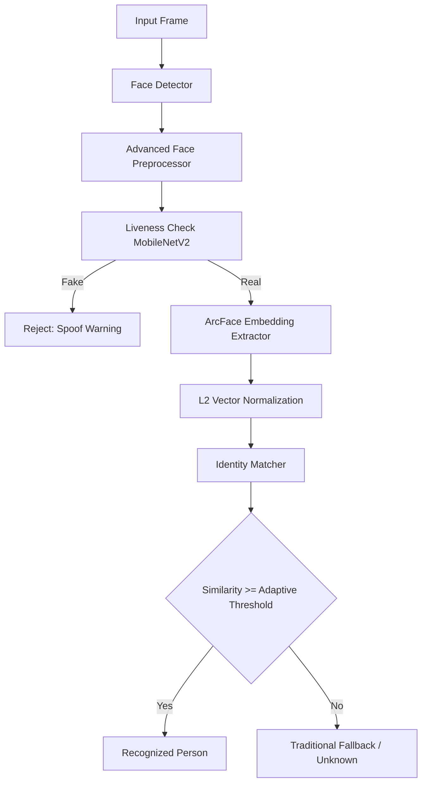

# System Architecture Reference

This reference details the technical implementation, algorithmic choices, and database structures of the Face ID Recognition system.

---

## 🏗️ Core Package Layout

The codebase uses a modular package structure separating configuration, processing, databases, and network adapters:

*   **`src/core/`**: Configuration parsing (`config.py`) and custom exception declarations (`exceptions.py`).
*   **`src/detection/`**: Face detection abstraction. Encapsulates RetinaFace, MTCNN, Haar Cascade, and Dlib models.
*   **`src/recognition/`**: Embedding generators. Supports ArcFace (default), FaceNet, VGGFace, and traditional recognizers. Handles L2 normalization and identity indexing (`face_identity_manager.py`).
*   **`src/processing/`**: Preprocessing (`advanced_face_processor.py`) and training data augmentation (`augmentation.py`).
*   **`src/liveness/`**: MobileNetV2 classification network for presentation attack detection.
*   **`src/quality/`**: Image quality assessment gates for registration validation.
*   **`src/database/`**: Core SQLite database connection pooling, query parameters, and binary serialization logic.
*   **`src/web/`**: Neumorphic dashboard template serving, session authentications, and REST API controllers.

---

## 🎨 Preprocessing Pipeline

Incoming frames undergo multi-step alignment and enhancement inside `AdvancedFaceProcessor` to standardize feature maps:

1.  **Face Landmark Alignment**:
    *   Detects key landmarks (eyes, nose, mouth).
    *   Calculates the rotation angle between left and right eye centers.
    *   Applies a 2D affine transformation to rotate the face horizontally and scale it, ensuring eyes are aligned on a fixed horizontal plane.
2.  **Lighting Normalization**:
    *   Converts BGR crops to LAB, YCrCb, and HSV color spaces.
    *   Applies Contrast Limited Adaptive Histogram Equalization (CLAHE) on the L, Y, and V channels independently.
    *   Combines the channels back to reduce extreme shadows and lighting variations (e.g. phone screen lighting, background exposure).

---

## 🧠 Feature Extraction & Recognition Recognizers



### 1. Model Support
*   **ArcFace (ONNX)**: The primary recognition model uses an ONNX-runtime optimized ResNet backbone (Buffalo_L backbone) to output a robust 512-dimensional embedding vector.
*   **Fallback Models**: Integrates FaceNet (Inception-ResNet) and VGGFace via standard wrappers to support comparative benchmarking.

### 2. Feature Normalization
To ensure fair similarity scoring, embedding vectors are L2-normalized:
$$\text{Normalized Embedding} = \frac{\mathbf{v}}{\|\mathbf{v}\|_2}$$
Cosine similarity is then calculated directly using the dot product of the normalized vectors.

### 3. Adaptive Thresholding
The system dynamically computes the classification threshold based on face quality scores:
*   **High Quality**: Applies a strict threshold (e.g. `0.40`) to minimize False Accepts.
*   **Low Quality/Low Light**: Relaxes the threshold (e.g. `0.55`) to maintain system usability and prevent False Rejects.

---

## 🔒 Biometric Protection Modules

### 1. Convolutional Liveness Detection
*   **Model**: MobileNetV2 binary classifier trained to distinguish between live subjects (Class 1) and spoof attempts (Class 0, e.g. printed paper, monitors, screens).
*   **Feature Integration**: Combines deep feature maps with Local Binary Pattern (LBP) texture descriptors to capture micro-texture depth discrepancies (printed photos lack human skin reflectivity).

### 2. Face Image Quality Assessment (FIQA)
Ensures that low-quality faces (blurry, dark, low contrast, small bounding boxes) are rejected during the registration enrollment phase:
*   **Sharpness**: Estimated using the variance of a Laplacian convolution over the gray crop.
*   **Contrast**: Evaluated using the standard deviation of intensity maps.
*   **Size Gate**: Prevents registration of faces below $160 \times 160$ pixels.

---

## 💾 NumPy Array Serialization in SQLite

To avoid Python pickle vulnerability threats (arbitrary code execution during deserialization), face embeddings are stored in SQLite using binary NumPy serialization:

*   **Saving to Database**:
    ```python
    import io
    import numpy as np
    
    # Serialize embedding vector
    buffer = io.BytesIO()
    np.save(buffer, embedding_array)
    binary_blob = buffer.getvalue()
    
    # Store binary_blob in a BLOB column inside SQLite
    ```
*   **Reading from Database**:
    ```python
    buffer = io.BytesIO(binary_blob)
    embedding_array = np.load(buffer)
    ```

---

## ⚡ Performance Optimizations

1.  **Skip-Frame webcam rendering**: The video capture loop skips recognition inference on 2 out of every 3 frames, relying on cached bounding boxes. This keeps rendering speed high (60 FPS) while maintaining recognition throughput.
2.  **Threaded Continuous Learning**: Recognitions that exceed the learning threshold trigger asynchronous database updates in a background thread, preventing camera UI stutter.
3.  **In-Memory Embedding Indexing**: Registered face embeddings are cached in memory inside `FaceIdentityManager` for fast similarity scans.
